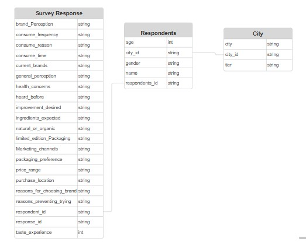
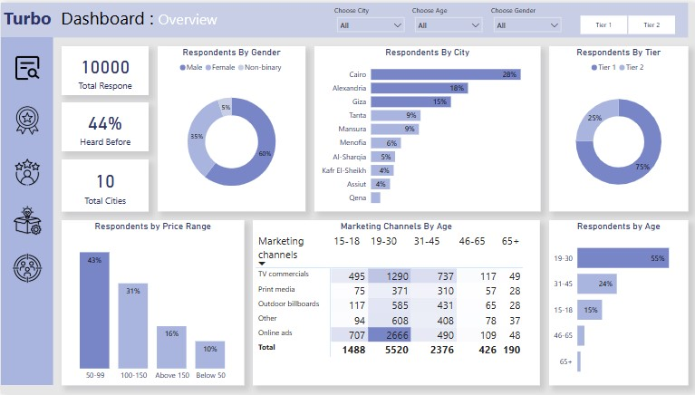
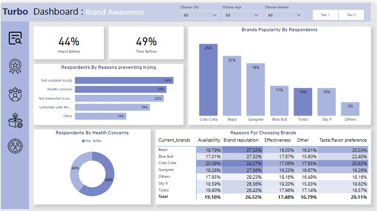
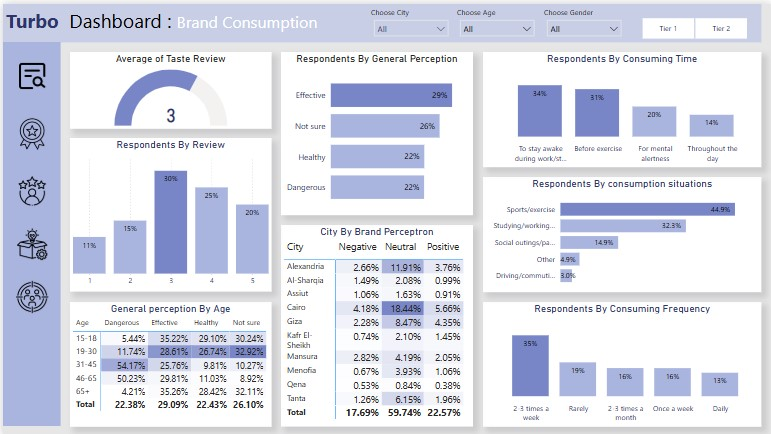
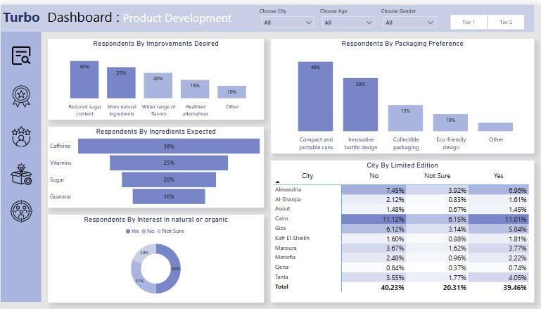
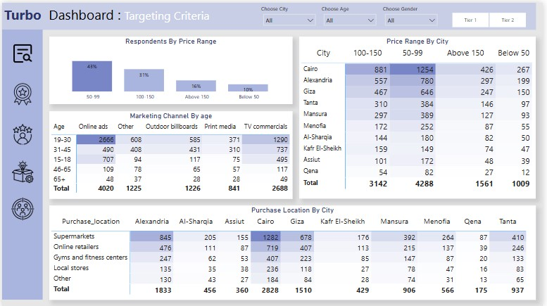

# Project Background

Turbo is a French beverage company that is aiming to make its mark in the Egyptian market. A few months ago, they launched their energy drink in 10 cities in egypt
The Marketing team is responsible for increasing brand awareness, market share, and product development.
They conducted a survey in those 10 cities and received results from 10k respondents.

Insights and recommendations are provided on the following key areas:

- **Demographic Insights:** Preferences by gender, age group and cities.
- **Brand Awareness:** percentage of heard, tried  before, reason preventing from trying, and health concerns.
- **Competition Analysis:** other brands popularity and reasons for choosing them.
- **Consumer Preferences:** reviews, pereception, Preferred times ,situations  and frequencies.
- **•Product Development:** prefered improvements, ingredients expected and packaging preferences. 
- **Targeting Criteria:** targeted price range, marketing channels and locations. 
 

The Python Notebook used to inspect, clean and analyze the data can be found here [link].

A pdf of a Power Bi dashboard used to report can be found here [link].

# Data Structure & Initial Checks

Turbo survey Database structure as seen below consists of three table: city, Respondents, Survey Response, with a total row count of 10,000 records. A description of each table is as follows:

# Executive Summary

### Overview of Findings
Turbo’s launch in Egypt shows promising awareness, with 44% of surveyed consumers recognizing the brand. The majority of respondents are men (60%), indicating an opportunity to engage more female consumers. While Turbo performs well in major cities like Cairo and Alexandria, expanding to other key urban centers could drive further growth. Young adults (18-30) dominate consumption, but a significant 31-45 age group also shows interest. Online ads are the most effective marketing channel, reinforcing digital engagement. With most purchases falling in the 50–150 EGP range, maintaining competitive pricing is essential for market penetration.

The entire interactive dashboard can be found here [link]

# Insights Deep Dive
### Demographic Insights:

* **Majority Male.** Out of 10 thousand respondents, 60% of the consumers are male who prefer energy drinks more.
  
* **Young Adult Dominance:.** The largest age group represented is 19-30 (55%) but If we look at overall young age groups from 15 to 30, then the Percentage  will rise to 70%.
  
* **Concentrated in Major Cities** The survey show us that 61% of the respondents are from big cities like Cairo, Alexandria and Giza .
  
* **Tier.** A significant 75% of respondents are classified as Tier 2.

### Brand Awareness:

* **44% Heard Before (Awareness).** This indicates moderate brand awareness. It means that 44% of the respondents have heard of the TurboX brand before.it leaves a large portion of the market unaware of the brand.
  
* **49% Tried Before (Trial).** This suggests that while awareness is decent, converting that awareness into actual product trial could be improved.
  
* **Reasons Preventing Trying.**
The biggest barrier to trial is availability (24%), indicating a distribution issue. Health concerns (23%) are also significant, suggesting a need for transparency about ingredients and benefits. Lack of interest in energy drinks (22%) highlights a challenge in targeting this segment. Brand awareness is another issue, with (19%) respondents unfamiliar with Turbo. Lastly, "Other" reasons (13%) need further analysis to understand additional barriers
  
* **Health Concerns.**  majority of respondents have health concerns. This reinforces the importance of addressing health concerns related to energy drink consumption in marketing and communication efforts.
  
* **Brands Popularity.** Turbo's popularity is compared to competitors like Cola-Coka, Bepsi, and Blue Bull. it comes six . This helps assess TurboX’s market position, identify gaps, and find opportunities to improve its presenc.
  
* **Reasons For Choosing Brands.** Consumers choose energy drinks based on several key factors. Brand reputation (26.52%) is the top driver, meaning TurboX must build trust and a strong image. Taste (20.11%) is also crucial, so offering appealing flavors is essential. Availability (19.10%) highlights the need for better distribution. Effectiveness (17.48%) matters too—Turbo must prove it delivers energy and focus. Lastly, Other factors (16.79%) need further analysis to understand additional influences on consumer choice..

### Consumer Preferences:

* **Average Taste Review (3 out of 5).** This indicates a moderate satisfaction with the taste suggesting potential for improvement in taste or flavor variety.
  
* **General Perception.** Turbo's perception among consumers is mixed. 29% find it effective which in younger age groups. However, 26% are unsure, indicating a need for clearer communication about its benefits. 22% see it as healthy, which is low, especially since health concerns were a major trial barrier. Alarmingly, 22% within age groups (31-45 and 46-65) have a higher perception of dangerous showing the need to address safety concerns and correct any misinformation.
  
* **Consuming Time.** Most people consume Turbo to stay awake during work or study (34%), aligning with the typical energy drink use. 31% drink it before exercise, showing potential among fitness enthusiasts. 20% use it for mental alertness, emphasizing cognitive benefits. 14% consume it throughout the day, indicating a habit-forming pattern for some users.
  
* **Consumption Situations.** Turbo is primarily consumed during sports/exercise (44.9%), making fitness enthusiasts a key audience. 32.3% drink it while studying or working, reinforcing its role in staying awake. 14.9% use it in social settings, showing some demand at parties. 3.0% consume it while driving or commuting, a smaller but notable group. 4.9% fall under "Other" situations, requiring further analysis.

* **Consuming Frequency.** Turbo consumption varies, with most users drinking it rarely or 2-3 times a week. This insight is crucial for inventory management and marketing strategies, helping target occasional consumers while encouraging more frequent use.

### Product Development:

* **Improvements Desired.** Consumers prioritize healthier options.  30% want less sugar, making it the top desired improvement.  25% seek more natural ingredients, and 20% desire a wider range of flavors.
  
* **Ingredients Expected.**As we know caffeine increases attention and alertness, and it is often used in energy drinks. Caffeine is the most expected ingredient followed by the Vitamins in energy drinks.
  
* **Natural or Organic.** A significant portion of respondents are either interested in or open to natural/organic options, suggesting a potential market for such a product.
  
* **Packaging Preference.**Practicality and appealing design are both important. 40% prefer compact and portable cans, while 30% are drawn to innovative bottle designs.
  
* ** Limited Edition Interest.**Interest in limited editions varies by location. Cairo shows the strongest interest, with 11.01% saying "yes." Overall, across all cities, only about 40% said no to limited editions, leaving a significant portion open to the idea.

### Targeting Criteria:

* **Price Range.**  Majority of customers (74%) prefer prices between 50-150, indicating a mid-range price strategy is optimal, The pricing strategy should be flexible by city—affordable pricing in smaller cities and mid-to-premium pricing in larger urban areas, We can do this by by making difffernt sizes and versions to cover a wide area of the consumers.
  
* ** Marketing Channel.** Digital marketing (online ads and TV commercials) is the best approach for younger demographics (19-20, 31-45 years old).
  
* **Purchase Location.**  Retail strategies should prioritize supermarkets and online channels, with Cairo being the primary focus.
  

# Recommendations:

Based on the insights and findings above, we would recommend the [stakeholder team] to consider the following: 

## What immediate improvements can we bring to the product?

*  Enhance Product Appeal & Reduce Health Concerns (23% barrier). **Launch a low-sugar variant, Add natural ingredients to align with health-conscious trends, Enhance taste based in the ingredients expexted caffeine & vitamin also Implement limited-edition flavors**

## What should be the ideal price of our product?
  
*  Implement a Flexible Pricing Model (74% prefer 50-150 EGP range). **we should introduce diffrent sizes and versions based on the cusromers  for example: Small-size cans (affordable) for students & workers, Standard-size cans (mid-range) for the core audience (urban young adults), Premium packaging (higher pricing in Cairo & Alexandria) for a high-end version.**

## What kind of marketing campaigns, offers, and discounts we can run?
  
* Online Ads & TV Commercials Work Best. **Run platform-specific ads for example (TikTok for under 18, Instagram for 19-30, Facebook for 31-45),
Use gamified ad campaigns where consumers can win free Turbo cans, Sampling campaigns in gyms, offices, and universities,
Strategic billboard placements outside urban centers, Localized retail partnerships (supermarkets, gas stations).
Regional influencer marketing with giveaway samples,
Targeted outdoor advertising in high-footfall areas.**
  
 **Loyalty rewards (Buy 5, Get 1 Free), Exclusive in-app discounts for frequent buyers, Turbo-sponsored esports & gaming nights to encourage habitual use, sponsor fitness events, football tournaments, and 
 gyms, also  partner with tech startups, co-working spaces, and universities.**

## Who should be our target audience?

* Retail Expansion in Key Locations. **Focus on supermarkets & convenience stores in Cairo, Alexandria, and Giza.
Expand to smaller cities through online grocery platforms (Instashop, Talabat).
Gas stations & vending machines for impulse purchases.**
  
* Core Target: Young Urban Adults (15-35 years old). **University students, young professionals, and fitness enthusiasts,Primarily in Cairo, Alexandria, Giza, Mansoura, and Port Said.
Tech-savvy, social media users,trend-driven and Balance between staying active (sports, work) and needing energy boosts.**

*  Niche Target: Female Consumers (18-35 years old) – Underdeveloped Market. **Young women in Cairo, Alexandria, and Mansoura.
Fitness-focused, university students, and professionals.
Many avoid energy drinks due to health concerns (sugar, ingredients.**

  

# Assumptions and Caveats:

Throughout the analysis, multiple assumptions were made to manage challenges with the data. These assumptions and caveats are noted below:

* Assumption 1 (ex: missing country records were for customers based in the US, and were re-coded to be US citizens)
  
* Assumption 1 (ex: data for December 2021 was missing - this was imputed using a combination of historical trends and December 2020 data)
  
* Assumption 1 (ex: because 3% of the refund date column contained non-sensical dates, these were excluded from the analysis)
