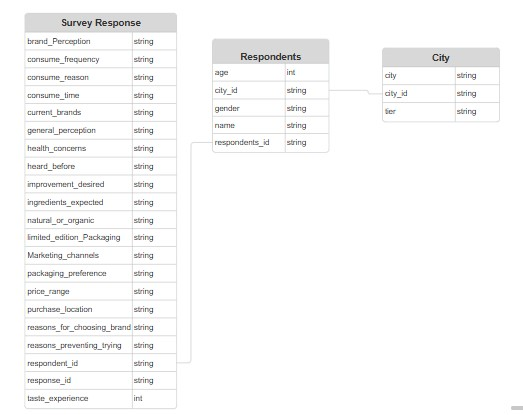

# Project Background

Turbo is a French beverage company that is aiming to make its mark in the Egyptian market. A few months ago, they launched their energy drink in 10 cities in egypt
The Marketing team is responsible for increasing brand awareness, market share, and product development.
They conducted a survey in those 10 cities and received results from 10k respondents.

Insights and recommendations are provided on the following key areas:

- **Demographic Insights:** Preferences by gender, age group and cities.
- **Brand Awareness:** percentage of heard, tried  before, reason preventing from trying, and health concerns.
- **Competition Analysis:** other brands popularity and reasons for choosing them.
- **Consumer Preferences:** reviews, pereception, Preferred times ,situations  and frequencies.
- **•Product Development:** prefered improvements, ingredients expected and packaging preferences. 
- **Targeting Criteria:** targeted price range, marketing channels and locations. 
 

The Python Notebook used to inspect, clean and analyze the data can be found here [link].

A pdf of a Power Bi dashboard used to report can be found here [link].

# Data Structure & Initial Checks

Turbo survey Database structure as seen below consists of three table: city, Respondents, Survey Response, with a total row count of 10,000 records. A description of each table is as follows:

# Executive Summary

### Overview of Findings
Turbo's launch in Egypt is off to a decent start, with almost half (44%) of those surveyed knowing the brand already.  Most of the people who answered the survey were men (60%), so Turbo might need to find ways to connect better with women.  They seem to be doing well in the big cities like Cairo and Alexandria, where most people live, but they should think about how to reach people in other cities too.  Young adults are their main customers right now, which is normal for energy drinks, but there's a good number of slightly older folks (31-45 years old) who might also be interested.  Finally, it looks like online ads are working best for them, and since most people are buying in the 50–150-pound range, Turbo needs to keep prices reasonable
The entire interactive dashboard can be found here [link]

# Insights Deep Dive
### Demographic Insights:

* **Majority Male.** Out of 10 thousand respondents, 60% of the consumers are male who prefer energy drinks more.
  
* **Young Adult Dominance:.** The largest age group represented is 19-30 (55%) but If we look at overall young age groups from 15 to 30, then the Percentage  will rise to 70%.
  
* **Concentrated in Major Cities** The survey show us that 61% of the respondents are from big cities like Cairo, Alexandria and Giza .
  
* **Tier.** A significant 75% of respondents are classified as Tier 2.

[Visualization specific to category 1]

### Category 2:

* **Main insight 1.** More detail about the supporting analysis about this insight, including time frames, quantitative values, and observations about trends.
  
* **Main insight 2.** More detail about the supporting analysis about this insight, including time frames, quantitative values, and observations about trends.
  
* **Main insight 3.** More detail about the supporting analysis about this insight, including time frames, quantitative values, and observations about trends.
  
* **Main insight 4.** More detail about the supporting analysis about this insight, including time frames, quantitative values, and observations about trends.

[Visualization specific to category 2]

### Category 3:

* **Main insight 1.** More detail about the supporting analysis about this insight, including time frames, quantitative values, and observations about trends.
  
* **Main insight 2.** More detail about the supporting analysis about this insight, including time frames, quantitative values, and observations about trends.
  
* **Main insight 3.** More detail about the supporting analysis about this insight, including time frames, quantitative values, and observations about trends.
  
* **Main insight 4.** More detail about the supporting analysis about this insight, including time frames, quantitative values, and observations about trends.

[Visualization specific to category 3]

### Category 4:

* **Main insight 1.** More detail about the supporting analysis about this insight, including time frames, quantitative values, and observations about trends.
  
* **Main insight 2.** More detail about the supporting analysis about this insight, including time frames, quantitative values, and observations about trends.
  
* **Main insight 3.** More detail about the supporting analysis about this insight, including time frames, quantitative values, and observations about trends.
  
* **Main insight 4.** More detail about the supporting analysis about this insight, including time frames, quantitative values, and observations about trends.

[Visualization specific to category 4]

# Recommendations:

Based on the insights and findings above, we would recommend the [stakeholder team] to consider the following: 

* Specific observation that is related to a recommended action. **Recommendation or general guidance based on this observation.**
  
* Specific observation that is related to a recommended action. **Recommendation or general guidance based on this observation.**
  
* Specific observation that is related to a recommended action. **Recommendation or general guidance based on this observation.**
  
* Specific observation that is related to a recommended action. **Recommendation or general guidance based on this observation.**
  
* Specific observation that is related to a recommended action. **Recommendation or general guidance based on this observation.**
  

# Assumptions and Caveats:

Throughout the analysis, multiple assumptions were made to manage challenges with the data. These assumptions and caveats are noted below:

* Assumption 1 (ex: missing country records were for customers based in the US, and were re-coded to be US citizens)
  
* Assumption 1 (ex: data for December 2021 was missing - this was imputed using a combination of historical trends and December 2020 data)
  
* Assumption 1 (ex: because 3% of the refund date column contained non-sensical dates, these were excluded from the analysis)
